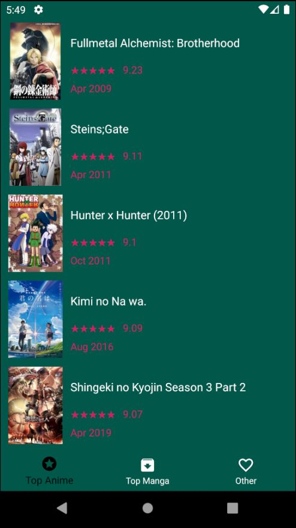

# Application Top Anime

## Présentation

Premier projet utilisant Android Studio. Projet démontrant l'utilisation d'une architecture MVC dans une application android codé en Java

L'application affiche le Top des animes en se basant sur la note averall, affiche également une vue détaillé des animes en cliquant dessus. Utilisation d'une API.


## Prérequis


- Installation d'Android Studio

````
https://github.com/Thebootfinder/ProjetMobile4A.git
````

## Consignes respectées : 

- Appels API REST
- Affichage d'une liste dans un RecyclerView
- Affichage des détails d'un item de la liste en cliquant dessus
- Architecture MVC 
- Utilisation de Fragment 
- GIT
- Fonctions supplémentaires :
  - Singleton
  - Fichier Constants
  - SplashScreen

## Fonctionnalités: 

### Premier écran 

- SplashScreen affichant une image d'introducton 


### Ecran d'Accueil  

- Affichage de la liste Top Anime avec : 
  - Affiche de l'Anime
  - Nom de l'anime
  - Note avec un affichage étoile 
  - Date de sortie



### Ecran détail de l'anime

- Affiche de différente information sur l'anime :
  - Nom de l'anime
  - Age conseillé
  - Note
  - Rank
  - Synopsis 
- Utilisation d'une ScrollView si trop d'information 


### Compétence apprise 

- IDE Android Studio
- Recycler_View
- Fragment
- Utilisation d'un API REST 
- Architecture MVC 
- Singleton 
